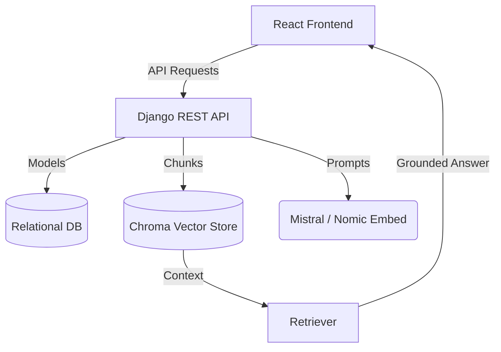

# Scientific Research Navigator

A **session-based Retrieval-Augmented Generation (RAG)** system designed for researchers to explore, analyze, and synthesize scientific literature with strict grounding and citation support.


---

## Key Features

### Isolated Research Sessions
- **Contextual Integrity**: Each session maintains its own isolated vector store (Chroma), document list, and conversation history.
- **No Contamination**: Researching "Quantum Computing" in one session won't bleed into your "Molecular Biology" session.
- **Full Lifecycle Management**: Create, rename, and delete sessions with automatic cleanup of associated vectors and files.

### Multi-Source Document Ingestion
- **Local Uploads**: Process scientific PDFs with semantic chunking and metadata enrichment.
- **External Integration**: Search and import papers directly into your session from:
  - **arXiv** (General Science)
  - **PubMed** (Life Sciences & Bio-medical)
  - **Semantic Scholar** (Cross-disciplinary)
  - **ACL Anthology** (Computational Linguistics & NLP)
  - **medRxiv** (Health Sciences)
- **Background Processing**: Real-time status tracking (Uploaded → Processing → Indexed).

### Advanced RAG Modes
- **QA Mode**: Traditional question answering with strict grounding—model refuses to answer if evidence is missing in the retrieved context.
- **Compare Mode**: Automated cross-paper analysis identifying claims and stances across multiple documents.
- **Literature Review**: High-level synthesis of selected papers to generate cohesive research summaries.
- **Strict Citations**: Every answer includes page-level citations linked to the source PDF.

### Monitoring & Performance
- **Metrics Dashboard**: Track query latency, ingestion times, and retrieval accuracy.
- **Run Logs**: Detailed audit of every LLM interaction and retrieval step.

---

## Tech Stack

- **Backend**: Django 6.0+, Django REST Framework (DRF)
- **LLM Engine**: Ollama (Mistral 7B)
- **Embeddings**: Nomic-Embed-Text
- **Vector DB**: ChromaDB
- **Frontend**: React.js with a modern Dark/Light mode interface
- **Task Handling**: Threaded background ingestion

---

## Setup Instructions

### 1. Prerequisites
- **Python 3.10+**
- **Node.js & npm**
- **Ollama** installed and running

### 2. Prepare Models
```bash
ollama pull mistral
ollama pull nomic-embed-text
```

### 3. Backend Setup
```bash
cd backend
python -m venv venv
# Windows:
.\venv\Scripts\activate
# Linux/Mac:
source venv/bin/activate

pip install -r requirements.txt
python manage.py migrate
python manage.py runserver
```
*Backend runs at `http://127.0.0.1:8000`*

### 4. Frontend Setup
```bash
cd frontend
npm install
npm start
```
*Frontend runs at `http://localhost:3000`*

---

## Architecture Overview



---

## Important Notes
- **Hardware Acceleration**: GPU acceleration for Ollama is highly recommended for viable latencies.
- **Hallucination Control**: The system is intentionally conservative. If it cannot find a definitive answer in the provided sources, it will state so rather than hallucinating metadata or content.
- **Environment**: This project is optimized for Windows (WSL) and Linux environments.